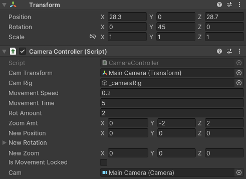
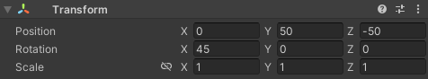
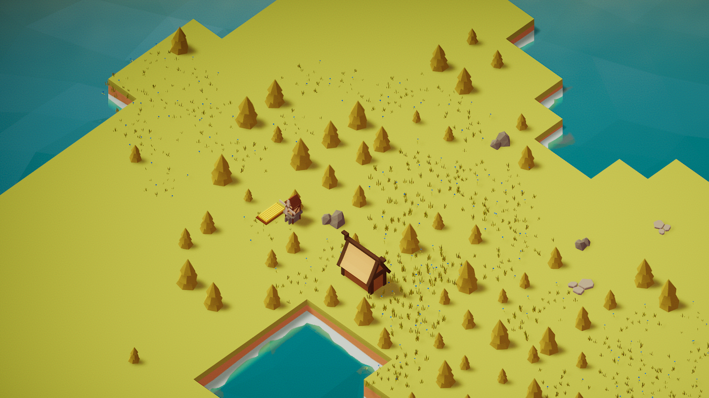

# orthographic-camera-controller

## 📸 About

This is an orthographic camera controller for the unity game engine, that can be used either with orthographic cameras or perspective cameras.

### 🔧 Configuration

To set up the camera controller you need to create a new "empty game object" as camera rig, set it's x and z position to any value that suits your starting position and the y rotation to 45 degree.
After that create a new camera as child of your camera rig game object and set it's y position value to any value that suits your scene. Important is to not forget setting the x rotation value of your camera to 45 degree. After that you can specify all the other parameters to your liking!

Here is a sample setup with screenshots from my game:

1) Camera rig game object

2) Camera game object:

3) Preview

### 🎮 Controls

  <li>Move the camera around: W, A, S, D or the arrow keys</li>
  <li>Turn Camera by 90°: Q, E</li>
  <li>Zoom: Mouse wheel</li>
  <li>Fast and slower speed: shift, left ctrl</li>

## 🧭 Patch Notes

Feel free to open an issue, if you found a bug or have an idea for additional features!

### Changelog
<ul>
  <li>V1.0</li>
      <ul>
        <li>Uploaded first version of CameraController</li>
      </ul>
</li>
